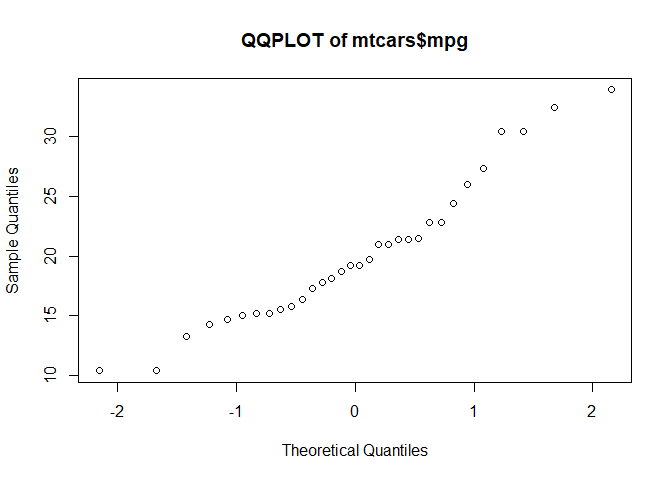
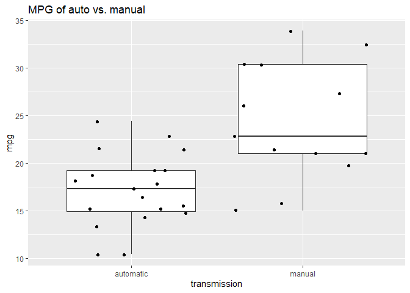
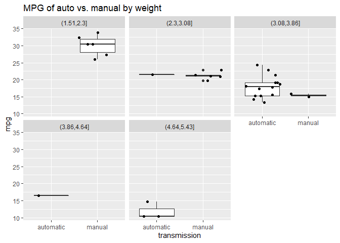
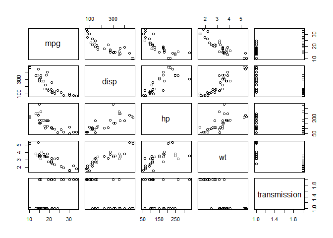
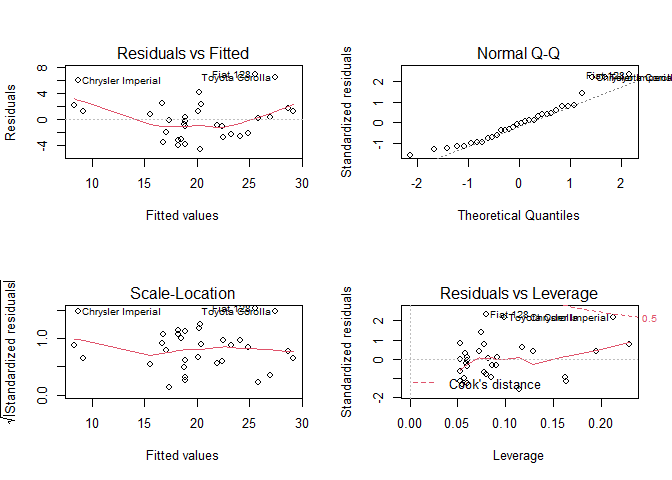

# Executive Summary
In the analysis below, I examine the MTCARS dataset to determine the relationship between a manual transmission and MPG.  Specifically, I answer these two questions: 

1. "Is an automatic or manual better for MPG?"
2. "Quantify the MPG difference between automatic and manual transmissions."

**Conclusion**

While the initial observational summary shows that cars with a manual transmission get better MPG (+7.2 MPG for manual), a multivariate model reveals a more complex relationship, when considering other explanatory variables like a vehicle's weight.  **Ultimately, I conclude that an manual transmission gets slightly worse MPG (-.02MPG for manual) when controlling for the vehicle's weight.**

**Methodology**
As shown below, first, I consider whether the fits a normal distribution.  Second, perform EDA to explore the relationships between key variables, and identify potential predictor variables.  Then, I build several models considering the effect of a manual transmission on MPG.  I build the following 4 models, and then choose the second model based on results from the ANOVA function, Variance Inflation results, and model performance (R squared) metrics.

1. Model1: mpg ~ transmission  
**2. Model2: mpg ~ wt + transmission  **  **<- Selected for low p value, low VIF, and high R^2 **
3. Model3: mpg ~ wt * transmission  
4. Model4: mpg ~ wt + transmission + disp + hp  

## Setup
Start by setting (echo = TRUE) and declaring libraries to be used

```r
knitr::opts_chunk$set(echo = TRUE, warning = FALSE)  #"always use echo = TRUE" for this assignment, per notes
library(ggplot2)
library(regclass)
library(Hmisc)
```

## Data Import and Cleaning

In this section, I import the data and ensure that it follows a normal distribution so that lm() can be used.


```r
data(mtcars)
#str(mtcars)
## mpg, transmission, and several other potential variables

  ###########################################################
  ###                  Recode as factors                  ###
  ###########################################################
  mtcars$transmission <- as.factor(ifelse(mtcars$am == 0, "automatic", "manual"))
  mtcars$cyl <- as.factor(mtcars$cyl)
  mtcars$vs <- as.factor(mtcars$vs)


#crosstable to confirm
  with(mtcars, table(am, transmission))
```

```
##    transmission
## am  automatic manual
##   0        19      0
##   1         0     13
```

```r
  ###########################################################
  ###             Are the residuals normal?               ###
  ###########################################################
  
  qqnorm(mtcars$mpg, pch=1, main="QQPLOT of mtcars$mpg")
```

<!-- -->

```r
  #linear model is appropriate for this case
```

## Exploratory data analysis

In this section, I create a boxplot of MPG by manual vs. automatic, noting that manual gets better mileage; however, faceting by weight, this effect diminishes.


```r
  ###########################################################
  ###             Exploratory Data Analysis               ###
  ###########################################################
  
  
  # 1 way look - MPG of manual vs. auto
  # Average MPG: 17 for automatic, 24 for manual
  round(tapply(mtcars$mpg, mtcars$transmission, mean),1)
```

```
## automatic    manual 
##      17.1      24.4
```

```r
  #In this plot, we note that manual cars often get better MPG

  ggplot(data=mtcars, aes(x=transmission, y=mpg)) + 
    geom_boxplot()+
    geom_jitter() + 
    ggtitle("MPG of auto vs. manual")
```

<!-- -->

```r
  # #facet plots to examine average MPG within other variables
  # 
  # ggplot(data=mtcars, aes(x=transmission, y=mpg)) + 
  #   geom_boxplot()+
  #   facet_wrap(~cyl)

#cut the weight variable
  summary(mtcars$wt)
```

```
##    Min. 1st Qu.  Median    Mean 3rd Qu.    Max. 
##   1.513   2.581   3.325   3.217   3.610   5.424
```

```r
  #hist(mtcars$wt)
  #Cut the weight variable into 5 groups
  mtcars$weight_group <- cut(mtcars$wt, 5)
  #summary(mtcars$weight_group)
  
  #In this plot, we note that, when controlling for weight, automatic and manual perform similarly
  
  ggplot(data=mtcars, aes(x=transmission, y=mpg)) + 
    geom_boxplot()+
    facet_wrap(~weight_group) + 
    geom_jitter() + 
    ggtitle("MPG of auto vs. manual by weight")
```

<!-- -->

```r
  vars_to_drop <- c("am", "drat","displ", "qsec", "vs", "gear", "carb", "weight_group", "cyl")
  mtcars2 <- mtcars[,!names(mtcars) %in% vars_to_drop]
  
  pairs(mpg  ~ . , mtcars2)
```

<!-- -->
  
  
## Model Fitting 

In this section, I fit several models and, using ANOVA, VIF, and R squared as metrics, select a model


```r
  # manual by itself
  model1 <- lm(mpg ~ transmission, mtcars2)
  summary(model1)$coefficients
```

```
##                     Estimate Std. Error   t value     Pr(>|t|)
## (Intercept)        17.147368   1.124603 15.247492 1.133983e-15
## transmissionmanual  7.244939   1.764422  4.106127 2.850207e-04
```

```r
  #slightly negative when we take into account weight
  model2 <- lm(mpg ~ wt + transmission, mtcars2)
  model3 <- lm(mpg ~ wt * transmission, mtcars2)
  model4 <- lm(mpg ~ wt + transmission + disp + hp, mtcars2)

  ###########################################################
  ###             Model Selection, including VIF          ###
  ###########################################################  
  
  anova(model1, model2, model3, model4)
```

```
## Analysis of Variance Table
## 
## Model 1: mpg ~ transmission
## Model 2: mpg ~ wt + transmission
## Model 3: mpg ~ wt * transmission
## Model 4: mpg ~ wt + transmission + disp + hp
##   Res.Df    RSS Df Sum of Sq       F    Pr(>F)    
## 1     30 720.90                                   
## 2     29 278.32  1    442.58 66.4206 9.394e-09 ***
## 3     28 188.01  1     90.31 13.5538  0.001021 ** 
## 4     27 179.91  1      8.10  1.2156  0.279950    
## ---
## Signif. codes:  0 '***' 0.001 '**' 0.01 '*' 0.05 '.' 0.1 ' ' 1
```

```r
  #Based on the ANOVA above, models 3 and 2 are potential predictors based on their p values; model 4 is excluded

  summary(model1)$r.squared
```

```
## [1] 0.3597989
```

```r
  summary(model2)$r.squared
```

```
## [1] 0.7528348
```

```r
  summary(model3)$r.squared
```

```
## [1] 0.8330375
```

```r
  VIF(model2)
```

```
##           wt transmission 
##     1.921413     1.921413
```

```r
  VIF(model3)
```

```
##              wt    transmission wt:transmission 
##        2.728248       20.901259       15.366853
```

```r
  #Model 3 has 2 high a VIF to be considered; model 2 is selected
  
  summary(model2)$coefficients
```

```
##                       Estimate Std. Error     t value     Pr(>|t|)
## (Intercept)        37.32155131  3.0546385 12.21799285 5.843477e-13
## wt                 -5.35281145  0.7882438 -6.79080719 1.867415e-07
## transmissionmanual -0.02361522  1.5456453 -0.01527855 9.879146e-01
```

```r
  initial_coef <- summary(model1)$coefficients
  final_coefs <- summary(model2)$coefficients
  
  #Since anova excludes model 4 and VIF excludes model 3, I note that model 2 yields a parsimonious and trustworthy model.
```

However, it should be pointed out that there is some uncertainty here, as the R^2 of .75 only explains 75% of the variance.


## Residuals

Finally, I look at the model fit residuals to ensure our fit was appropriate and see no major issues.


```r
par(mfrow=c(2,2))    # set the plotting area into a 2*2 array
plot(model2)
```

<!-- -->

Final model coefficients: 37.3215513, -5.3528114, -0.0236152, 3.0546385, 0.7882438, 1.5456453, 12.2179928, -6.7908072, -0.0152786, 5.8434772\times 10^{-13}, 1.867415\times 10^{-7}, 0.9879146
